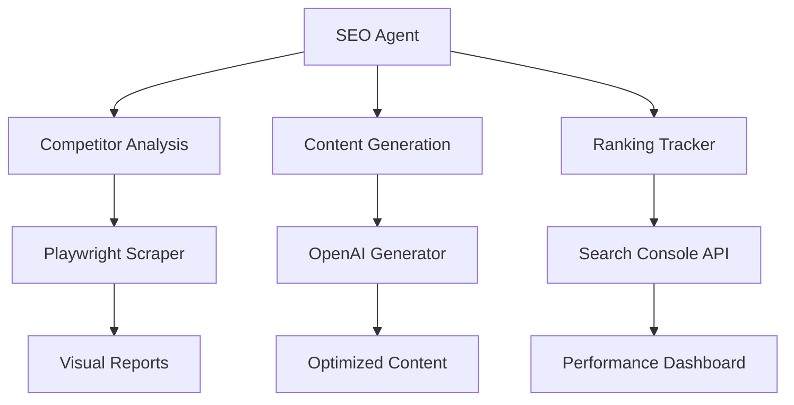

# 🎯 Rooferly Clean Development Setup

## ✅ **Current Clean State**
- **Commit**: `94b53ee` (August 19, 2025)
- **Status**: Clean Rooferly-only codebase
- **Website**: Working perfectly at rooferly.co
- **Playwright**: Configured and ready
- **OpenAI**: Integration ready

---

## 🛠️ **Your Workflow Goals**

### **1. GitHub Push/Pull in Cursor** ✅
```bash
# Already working! Use these commands:
git add .
git commit -m "Your commit message"
git push origin main

# To pull changes:
git pull origin main
```

### **2. Playwright MCP for Web Component Previews**
You mentioned you've used Playwright MCP before on this project. The current setup includes:
- ✅ `playwright.config.ts` - Configured for local development
- ✅ `tests/homepage.spec.ts` - Working test suite
- ✅ Playwright installed and ready

**To enable Playwright MCP functionality**, you may need to:
- Check if there's a specific MCP extension or plugin for Cursor
- Verify Playwright MCP configuration in your Cursor settings
- Ensure proper browser automation permissions

### **3. Agentic SEO/Marketing Tool Development**
Perfect foundation already in place:
- ✅ OpenAI integration (`lib/openai.ts`)
- ✅ Next.js app structure
- ✅ Rooferly brand guidelines (`docs/brand-guide.md`)
- ✅ SEO strategy docs (`docs/MARKETING_SEO_STRATEGY.md`)

---

## 🚀 **Next Steps for Agentic SEO Tool**

### **Phase 1: Core SEO Analysis Engine**
```typescript
// lib/seo-agent.ts
interface SEOAgent {
  analyzeCompetitors(): Promise<CompetitorAnalysis>
  generateContentStrategy(): Promise<ContentPlan>
  optimizeMetadata(): Promise<MetadataRecommendations>
  trackRankings(): Promise<RankingData>
}
```

### **Phase 2: Marketing Automation**
- Content generation for roofing industry
- Local SEO optimization for Chicago market
- Competitor analysis and gap identification
- Performance tracking and reporting

### **Phase 3: Playwright Integration**
- Automated competitor website analysis
- Visual regression testing for SEO changes
- Performance monitoring
- Content A/B testing

---

## 📁 **Recommended Project Structure**

```
rooferly-digital/
├── lib/
│   ├── openai.ts              ✅ (exists)
│   ├── seo-agent.ts           🔄 (to create)
│   ├── competitor-analyzer.ts 🔄 (to create)
│   └── content-generator.ts   🔄 (to create)
├── app/
│   ├── seo-dashboard/         🔄 (to create)
│   ├── competitor-analysis/   🔄 (to create)
│   └── content-studio/        🔄 (to create)
├── tests/
│   ├── homepage.spec.ts       ✅ (exists)
│   ├── seo-analysis.spec.ts   🔄 (to create)
│   └── competitor.spec.ts     🔄 (to create)
└── docs/
    ├── brand-guide.md         ✅ (exists)
    └── seo-strategy.md        ✅ (exists)
```

---

## 🎭 **Playwright MCP Troubleshooting**

If Playwright MCP isn't working:

1. **Check Cursor Extensions**
   - Look for Playwright or MCP extensions in Cursor
   - Verify they're enabled and updated

2. **Verify Configuration**
   ```bash
   # Test Playwright works manually
   npx playwright test --headed
   ```

3. **Check MCP Settings**
   - Look in Cursor settings for MCP or Playwright configuration
   - Ensure proper permissions for browser automation

---

## 🤖 **Agentic Tool Architecture**



---

## 🎯 **Immediate Action Items**

1. **Test Current Setup**
   ```bash
   npm run dev
   npx playwright test
   ```

2. **Enable Playwright MCP** (if not working)
   - Check Cursor extensions/settings
   - Verify browser permissions

3. **Start SEO Agent Development**
   - Create basic SEO analysis functions
   - Integrate with OpenAI for content generation
   - Build competitor analysis with Playwright

---

**🏠 Ready to build the ultimate roofing industry SEO tool!**
